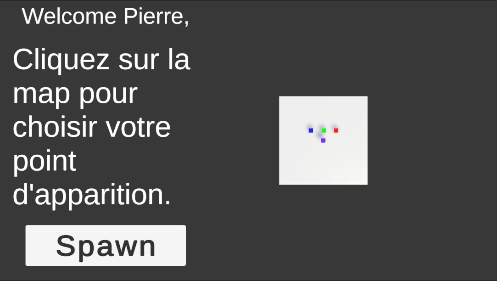
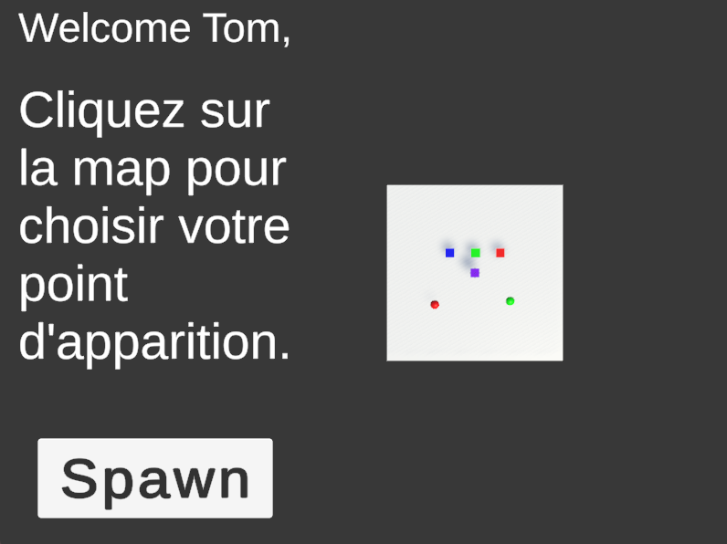
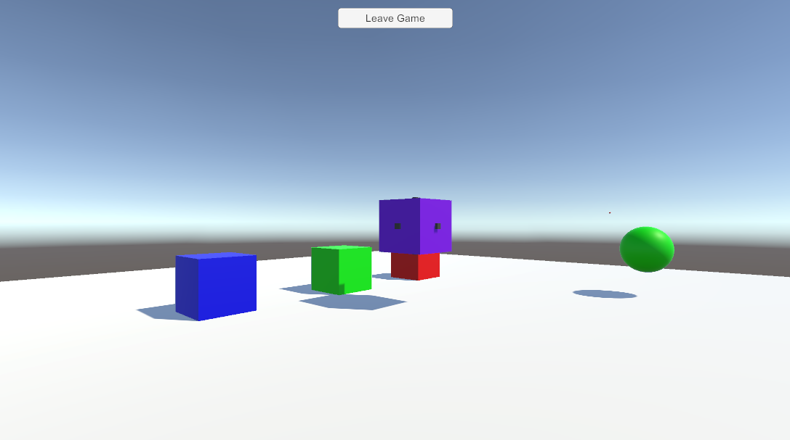
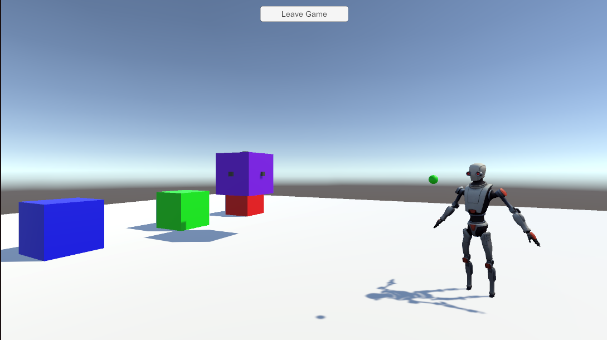

# TP Collaboration dans un environnement virtuel

Ce projet rassemble les étapes 1,3 et 6 ainsi qu'un ajout personnel pour le cours d'[UE RVRA du M2 SIIA et UE RVC de la TAF IHM](https://sites.google.com/view/ue-ieva-du-m2-siia/practical-classes/1-first-steps-with-unity-and-photon) de M Thierry Duval.

## Spécifications 

Pour les parties 1 à 6, je n'ai pas rencontré de grosse difficultés, hormis pour la partie 6 avec la manipulation collaborative du cube. Il fallait gérer quelques problèmes de partage de position locale vs globale maias j'ai réussi à le corriger.

Je me suis permis de modifier la manière de partager les informations sur le joueur entre les scènes. Dans le TP on utilise les PlayerPrefs mais 
j'ai préféré passer par une classe qui possède une instance unique, statique et mise en DontDestroyOnLoad. 
Cela permet d'acceder aux informations du joueur (nom, couleur choisie) depuis n'importe quelle scène mais sans inclure de 
persistence intersession (comme c'est le cas avec PlayerPrefs).

## Ajout personnel

Concernant l'ajout personnel, j'ai décidé d'ajouter un écran d'accueil lorsque l'on se connecte au serveur.
Plaçons nous dans le cas où deux joueurs veulent collaborer : 'Pierre' et 'Tom'.

Lorsqu'ils se connectent au serveur, ils arrivent sur un écran d'accueil où ils peuvent choisir leur nom et leur couleur, 
cela ne change pas. Ensuite ils arrivent sur cet écran : 

On voit sur la droite une vue aérienne de la scène. Les 3 cubes de couleur RGB sont les cubes du TP et le cube violet 
le cube avec des poignées de la partie 6 du TP.

Il faut cliquer sur la map pour positionner son point d'apparition et un point de notre couleur apparaît alors. Dans
notre cas d'application, 'Pierre' a choisi la couleur rouge, et 'Tom' la couleur verte.

Ils ont tous les deux selectionné un point d'apparition et on voit leur deux petit points pour indiquer qu'ils souhaitent
apparaître à cet endroit. 

Lorsque 'Pierre' apparaît, son point sur la map devient beaucoup plus gros sur la map de 'Tom' : 

Du point de vue de 'Pierre', il voit aussi là où 'Tom' veut apparaître grace à une boule de sa couleur :

Enfin, lorsque 'Tom' clique sur Spawn, il appparaît bien là où sa boule était positionnée : 

## Implémentation

La vue aérienne se fait gràce à une caméra isométrique qui est placée au dessus de la scène.
Lorsque l'utilisateur clique sur la map, on récupère la position du clic et on la convertit en coordonnées de la scène.
Une boule de la couleur de l'utilisateur est alors instanciée à cette position et est visible par les autres joueurs coonnecté car c'est un object avec un PhotonTransformView.

Cela permet de voir où les joueurs veulent spwaner, que ce soit pour ceux qui sont déjà dans la scène ou ceux qui s'apprête à y entrer.

Quand un joueur est déjà dans la scène, pour l'indiquer aux autres joeurs, j'ai fait apparaître une plus grosse boule au dessus
de lui et de sa couleur. Cette boule appartient à une layer spécifique ce qui fait que seule la caméra aérienne peut la voir et l'afficher. 

